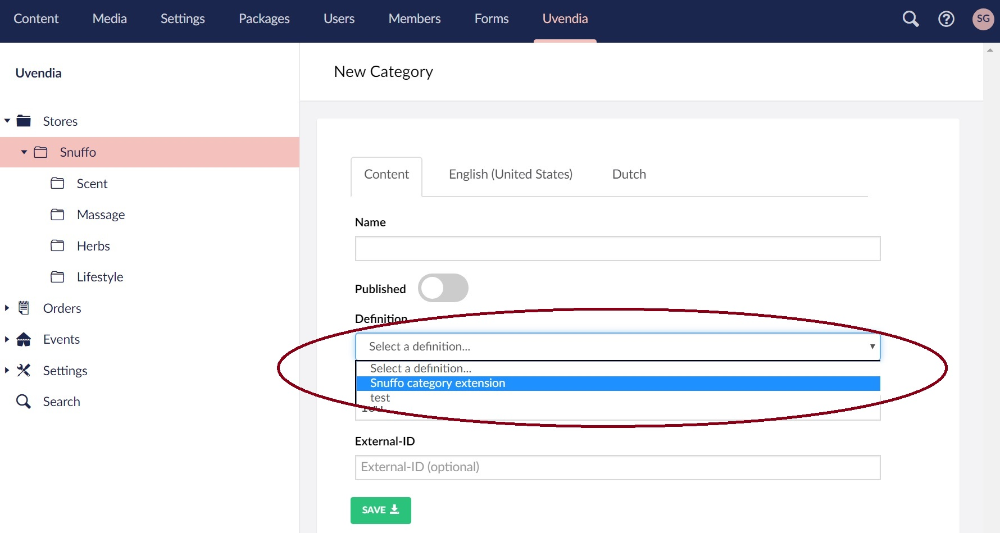

# Managing Categories

 After you created a store you need to create one or more categories. Go to _Uvendia > Store > [New Store]_ and ```right-click``` on the tree node or hit the button ```Create Category``` and start filling in the form.



## Extended properties
In case you need extra custom properties to describe your category, select the [definition](/settings/propertydefinition.md) previously created and the extended properties will automatically render.

## Translations
**Uvendia** supports [multi-languages](/settings/languages.md) as seen in the screenshot below. Each asset will contain tabs on which you can enter the ```Display name```, ```Short description``` and ```Long description``` translated to the language displayed on the tab.

