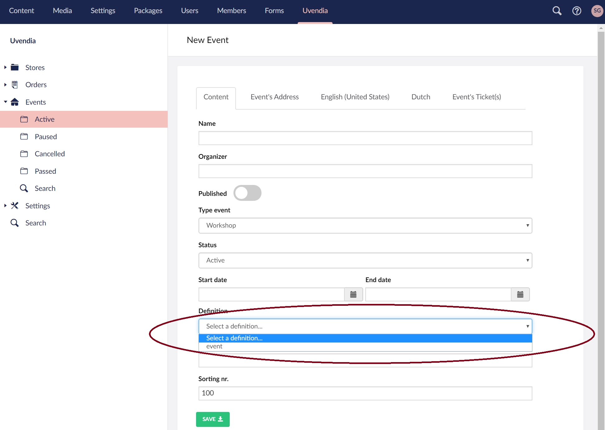

# Managing Events

**Uvendia** comes with a very useful ```Event``` management component. By using this component you easily can add events to your webshop and sell tickets. Each ticket will be provided with a ```QR-Code``` and ```Bar-code``` for easy scanning. Go to _Uvendia > Events_ and hit the button ```Create Event``` and start filling in the form.



## Extended properties
In case you need extra custom properties to describe your event, select the [definition](/settings/propertydefinition.md) previously created and the extended properties will automatically render.

## Tab: Event's Address
On this tab you can enter the address where the event will take place.


## Tab: Translations
**Uvendia** supports [multi-languages](/settings/languages.md) as seen in the screenshot below. Each asset will contain tabs on which you can enter the ```Display name```, ```Short description``` and ```Long description``` translated to the language displayed on the tab.


## Tab: Event's Ticket(s)
Use this tab to configure your tickets. 
> Make sure you added your [ticket types](/settings/tickettype.md) before starting on this page.


### Total tickets available
The value enter here, which is optional, will be the total tickets available to sell to customers. 
All the available ``ticket types`` you add by hitting the button ``Add New Ticket Type``, cannot surpass the value of ``Total tickets available``.
When adding ticket types, make sure you specify a ``description``.

### Cancellation insurance
In some cases you need to configure a ``Cancellation insurance`` for your customers to give them the possibility to cancel for an event. 

### Generate report sold tickets
By hitting this button you can generate an excel file containing all the tickets sold for the current event.

### Generate CodeReadr CSV
[CodeReadr](https://www.codereadr.com/) is an App you can install on your mobile device for scanning and validating event tickets. By hitting this button you can generate a CSV file to upload into [CodeReadr Asset Tracking Database](https://secure.codereadr.com).

### Generate Ticket
Use this button to generate tickets that will not be sold by your webshop. An (order)(/orders/order.md) will be created automatically.
