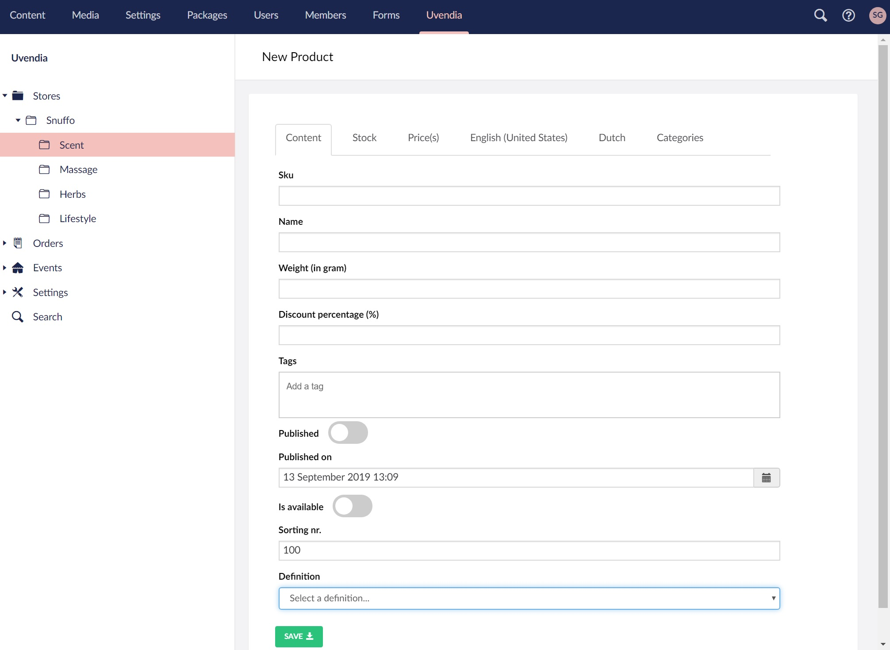
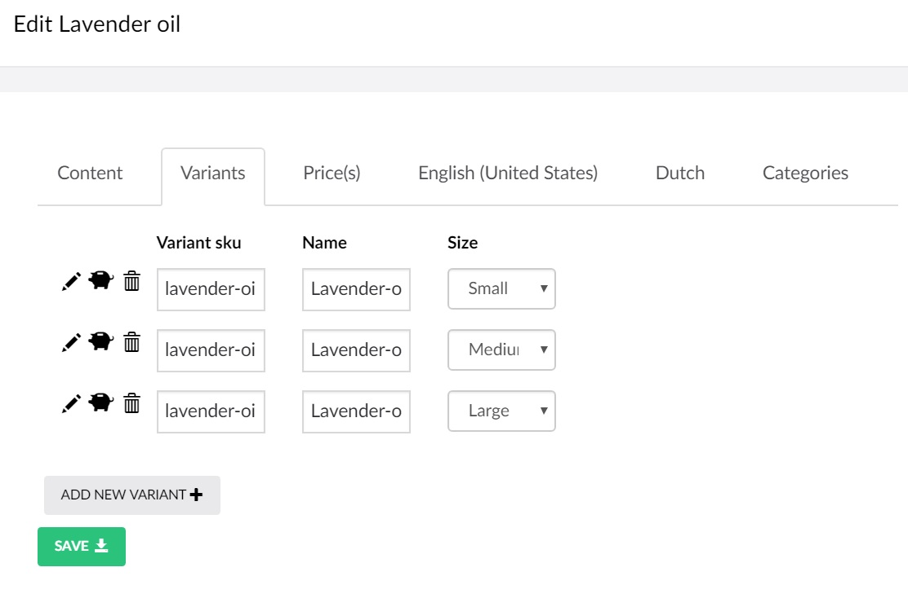

# Managing Products

After creating [categories](/assets/category.md) you can start adding products to your store. Go to _Uvendia > [New Store] > [New Category]_ and ```right-click``` on the tree node or hit the button ```Create Product``` and start filling in the product form.



## Extended properties
In case you need extra custom properties to describe your product, select the [definition](/settings/propertydefinition.md) previously created and the extended properties will automatically render. 

## Tags
Use the ```Tags``` input box to enter all the keywords that describes your product. These tags will be used in the ```search index```.

## Tab: Variants
In many cases a product consists of many variants. Like you have a ```tie``` and the variants will be the colors ```green```, ```purple``` and ```yellow```. In this situation you can create a [property](/settings/propertydefinition.md) of the type ```List``` containing the colors. This [property](/settings/propertydefinition.md) will have the checkbox ```Is variant property``` select to ```true```.
So when the product ```definition``` is set to this definition containing this variant property and you hit ```Save```, the ```Variants``` tab will immediately appear.



To ```add``` new variants hit the ```Add New Variant``` button. 

### Variant: Stock indication
To add ```Stock Indication``` and ```Stock Levels``` hit the  icon. On the ```dialog``` is it also possible to add your product variant description like described in the paragraph [Translations](#Translations).


### Variant: Price
To add ```prices``` hit the  icon. A ```dialog``` will appear to add [prices](/settings/pricedefinition.md).

## Stock indication
Product stock level (in case the product is not a variant) can be added on the tab ```Stock```.

## Price(s)
Product prices (in case the product is not a variant) can be added on the tab ```Price(s)```. The [price definitions](/settings/pricedefinition.md) need to be configured first.

## Translations
**Uvendia** supports [multi-languages](/settings/languages.md) as seen in the screenshot below. Each asset will contain tabs on which you can enter the ```Display name```, ```Short description``` and ```Long description``` translated to the language displayed on the tab.

