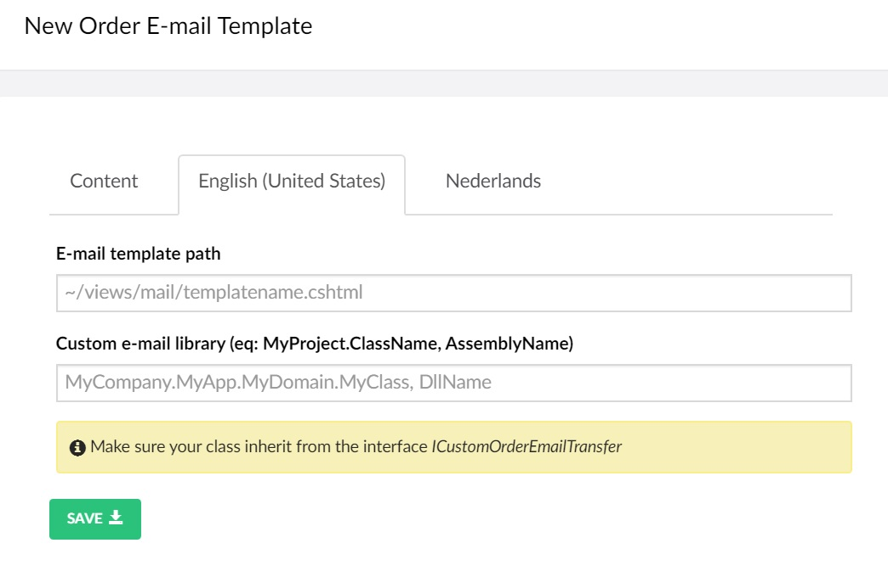

# Configuring order e-mail templates

When customers create orders, you can interact with them by sending custom made e-mails about their order status updates to them. On this settings page you can create endless custom made e-mails that will be send to your customers or maybe other company departments.


By ```default``` **Uvendia** provides you with a default e-mail template. You just had to enter a ```Template name``` (see screenshot above, first tab), upload an ```E-mail logo``` and check whether you want to send the ordered [tickets](/orders/order.md) ```Has tickets``` or the [invoice](/orders/order.md) ```Has invoice``` as PDF attachment. Voilà!!! You are ready to go! The e-mail your customers will receive is a default one written in english.

## Custom e-mail templates
On [language](/settings/languages.md) tab(s) is possible to configure your order e-mail template in different languages.



### E-mail template path
Here you can enter the path to the ```Razor``` .cshtml e-mail page. Make sure the ```Model``` is assigned to the ```OrderMailModel``` class.

```razor
@model Uvendia.Domain.Mvc.ViewModels.Mail.OrderMailModel
```
```C#
public class OrderMailModel
{
    public Order Order { get; set; }
    public string LogoUrl { get; set; }
    public CultureInfo CurrentCulture { get; set; }
}
```

### Custom e-mail library
In case you want to send a custom e-mail to a department, you can implement a class that inherits from ```ICustomOrderEmailTransfer```.

Code example:
```C#
public class TestCustomOrderEmailTranser : ICustomOrderEmailTransfer
{
    /// <summary>
    /// Test custom order emails
    /// </summary>
    /// <param name="arguments"></param>
    /// <returns></returns>
    public async Task SendEmail(CustomOrderEmailArgs arguments)
    {
        await Dazzling.Studio.Utils.EmailUtils.SendAsync(new EMail
        {
            Attachments = arguments.Attachments.IsNullOrEmpty() ? null : arguments.Attachments.ToArray(),
            Subject = "Test Order Email",
            ToAddress = arguments.InvoiceEmailAddress,
            Body = "THIS IS JUST A TEST!!!"
        });
    }
}
```