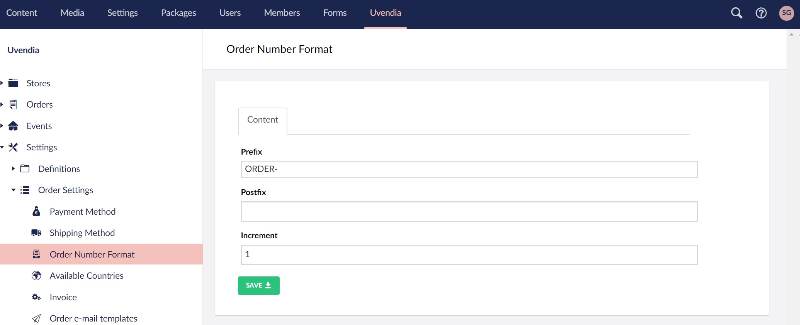

# Configuring Order Number Format

Each created order will be marked with a UNIQUE ```Order Number```. The ```format``` of this ```Order Number``` can be configured on this form.



## Prefix
```Default prefix``` is alway set on ```ORDER-```. You can change this text as you wish.

## Postfix
```Default prefix``` is alway ```empty```. You can add a ```postfix``` if desired.

## Increment
```Default increment``` is always set on ```1```. You can increase it if desired. The increase range is between ```1``` and ```9999```.
So each new order number will be increased with ```+ Increment value```.