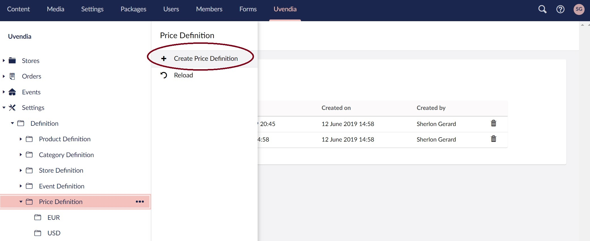
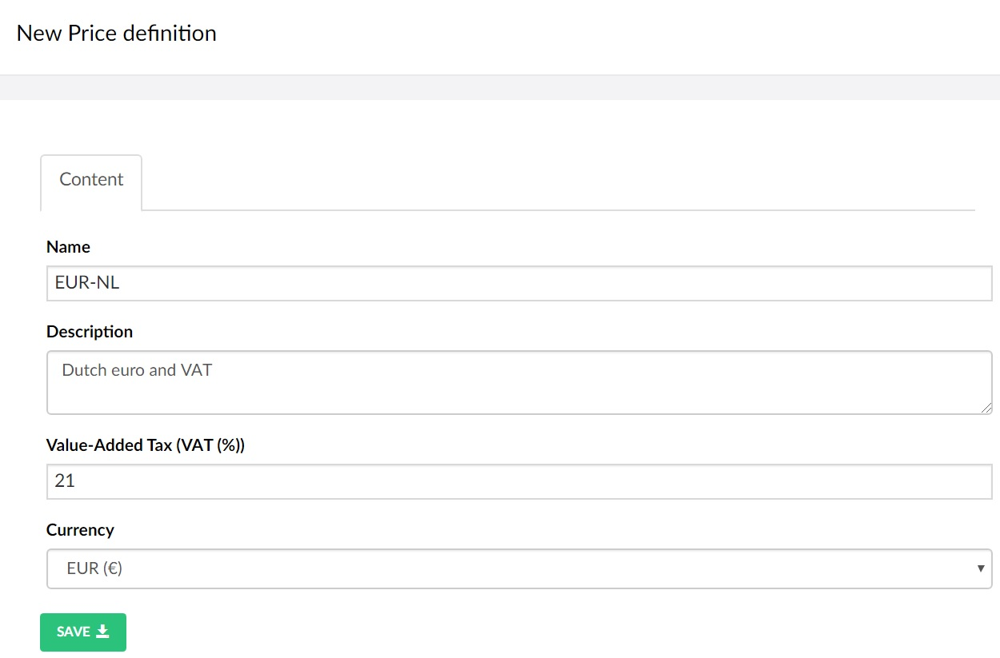

# Configuring Price Definitions

The _Price Definition_ configuration under _Uvendia > Settings > Definitions > Price Definition_ provides you with the functionality to define multiple _currencies_ (or in some cases the same currency) with the related _Value-Added Tax_ (VAT).

## Create Price Definition
Go to _Uvendia > Settings > Definitions > Price Definition_. ```Right-click``` on the section ```Price Definition``` and select ```Create Price Definition```.



Fill in the create form and select the right currency which is mandatory and hit ```save```.

