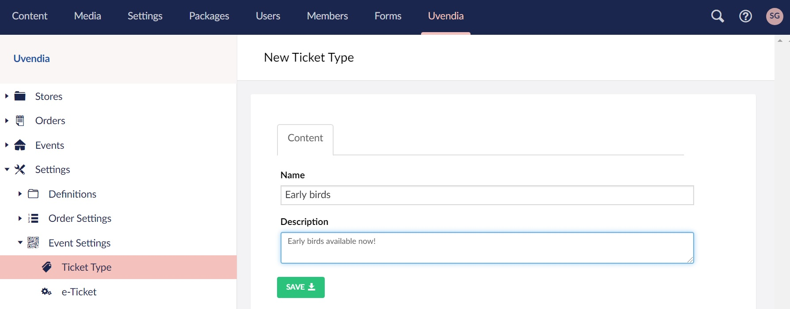

# Configuring Ticket Types

Creating ticket types are very easy. Just go to _Uvendia > Settings > Event Settings > Ticket Type_ hit the ```Create``` button and fill in the form and hit ```Save```.

