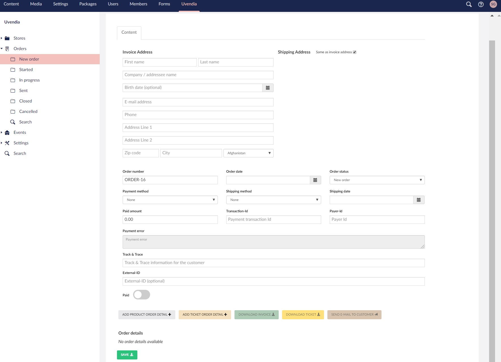
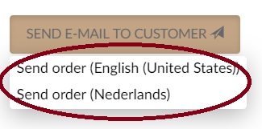

# Managing Orders
For managing your orders go to _Uvendia > Orders_. You will get a sub list of order states you can put your order in. Select an order status and start editing or creating a new order by hitting the button ``Create Order``.

## Paid
Most of the fields you see are very clear. In case you are creating an order manually, make sure when the customer has paid, you set the ``Paid`` indication on ``true``. Don't forget to fill in the ``Paid amount``.

## Shipping date
Don't forget to fill in the date when the package has been shipped. You can also automate this process.

## Send e-mail to customer
Like discussed [here](/settings/orderemailtemplated.md), when the ``order e-mail template`` settings are configured they will automatically appeared in this sub list when hitting this button (see screenshot below).

