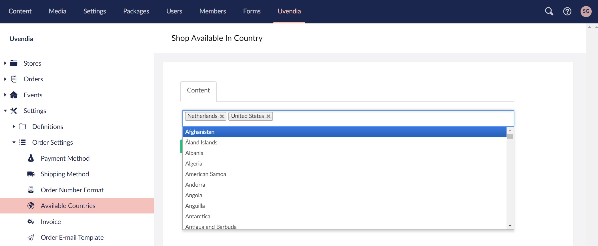

# Configuring available countries

On this settings page you can add all the countries in which your [Payment Method(s)](/settings/paymentmethod.md) or [Shipping Method(s)](/settings/shippingmethod.md) will be available. 
These country settings can also be used to determine whether the webshop is available or not in certain countries around the world.

