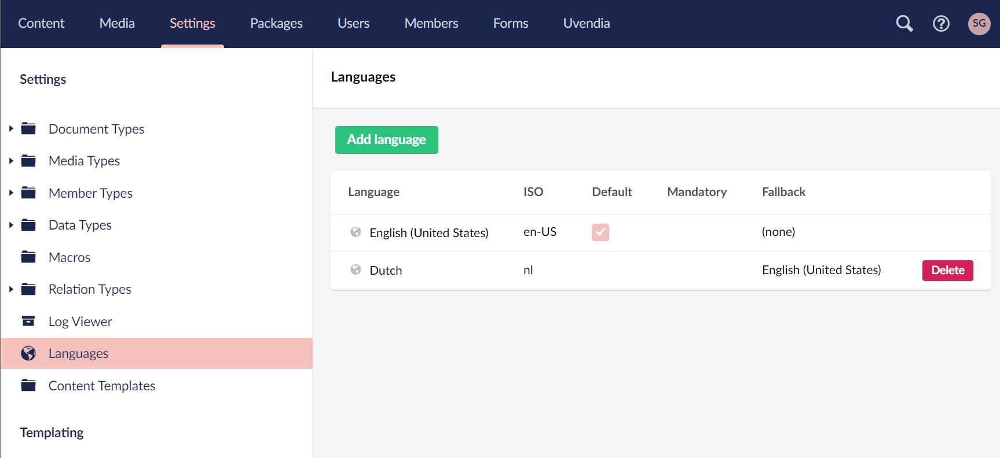

# Multi-language

**Uvendia** e-commerce component can handle multiple languages.

## Configuring languages
First-thing-first, you need to configure the languages you want to use in your webshop. In **Umbraco 8** is this available on this path: _Settings > Languages_. Just hit the button ```Add language``` and add as many languages you want.

