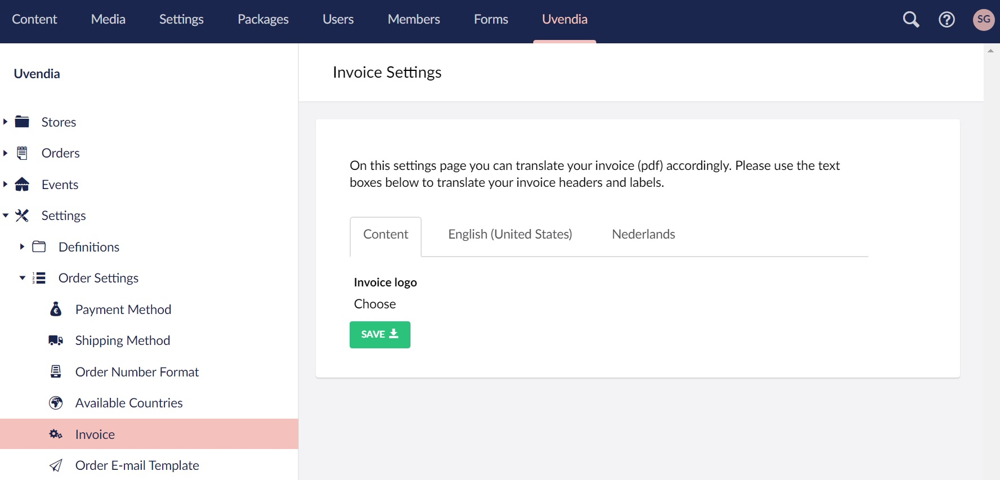

# Configuring invoice (PDF)
On this settings page you can translate the generated invoice (pdf) of an [order](/orders/invoice.md) accordingly. Go to _Uvendia > Settings > Order Settings > Invoice_. 

## Invoice logo
By uploading your logo (optional), each generated invoice will have your logo shown at the top of the invoice.



## Translations
For each [language](/settings/languages.md) configured in **Umbraco** a tab containing the ```Native Name``` of the language will appear as shown in the screenshot below. On each tab you can change or translate the text in the input box accordingly. Those translations will be the labels and headers of your order [invoice](/orders/invoice.md).

