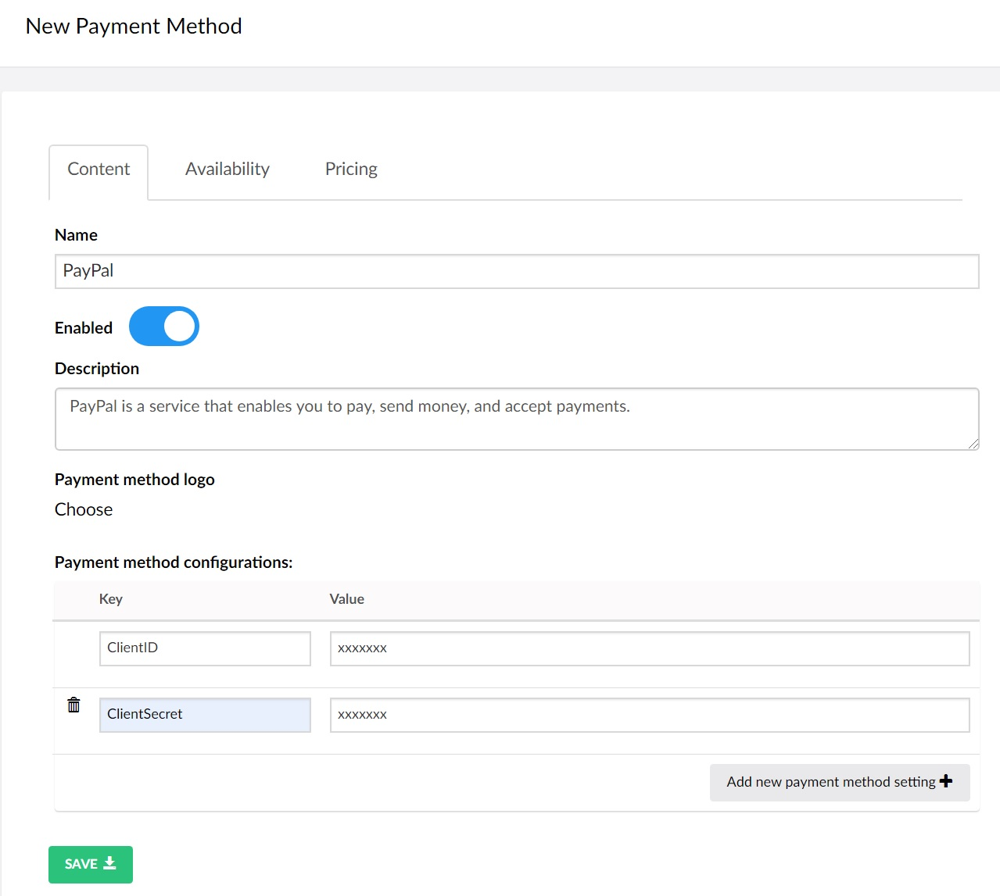
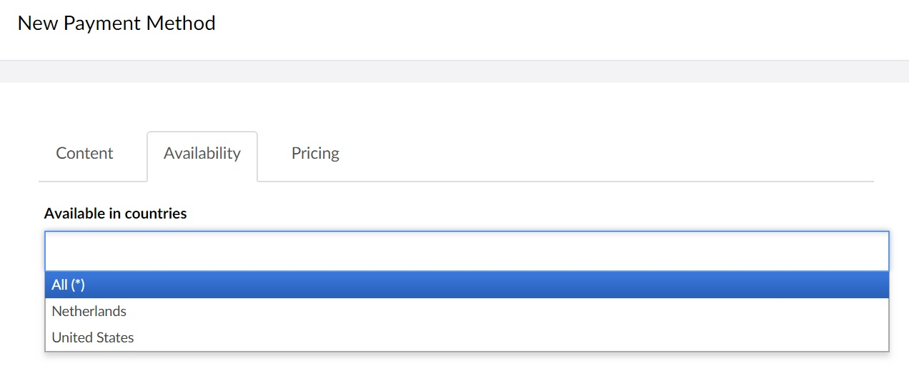

# Configuring Payment Methods

Every webshop has one or multiple payment services for accepting payments. **Uvendia** provides you with the functionality to configure all your payment methods. Go to _Uvendia > Settings > Order Settings > Payment Method_ and add your payment services by hitting the button ```Create Payment method```. 



## Tab: Content
On the create form first tab ```Content``` you can provide a name, disabled or enabled, description, payment service logo and the necessary configuration to make it work. 

## Tab: Availability
On the second tab ```Availability``` you can specify the countries in which the payment service will be available. For instance if you have customers in a country where a specific payment service is not available, based on this given information you can disable it for those specific customers.
The countries displayed here are specified in the settings section [Available countries](/settings/availablecountries.md) on _Uvendia > Settings > Order Settings > Available Countries_. The asterisk (*) symbol means that it will be available in every country around the world - you can also leave it empty



## Tab: Pricing
On the third tab ```Pricing``` you can specify the extra fees that will be charged to the customers for using the payment service. These are of course optional.


#### Service percentage fee (%)
The percentage specified here will be the percentage of the total order amount that will be charged as payment service fee. For instance if you entered a value of 1% service fee. 1% of the customer's total order amount will be charged as extra payment service fee.

#### Fixed fees
Use next table to specify fixed fees (prices) for each used [Price Definition](/settings/pricedefinition.md). For instance if you specify for the definition ```EUR``` 1 EUR, then for each transaction 1 EUR will be charged for each order.

