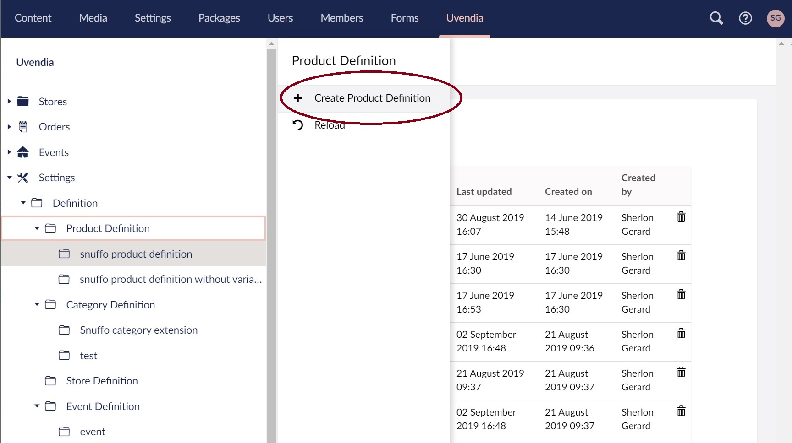

# Property / Value principle

The sections Store, Category, Product, Product variant and Event only provide a small set of basic properties (or fields) that you can use to describe your entity. In case you need more properties you can easily add more so to have a more _extended_ description of your store, category, product or event.

## Configuring extended properties
### Create Definition
Before adding extended properties you need to create a _property definition_ in which the extended properties will resides. Go to _Uvendia > Settings > Definitions_. ```Right-click``` on the section you want to add a new definition and select ```Create [Entity] Definition```.



### Definition inheritance
Definitions can also inherit from each other. For instance you want to create another definition for another set of products. These new set of products contains the basic properties created before plus a few extra new properties. In this case you can create a new definition that inherit from the previous one.


### Create Property
To create a new property please go to _Uvendia > Settings > Definitions > [Section] Definition > [New Definition] > Create Property_


#### Name
The property name must be ```unique``` and it is ```required```.

#### Definition
The selected definition is based on the definition you selected before hitting ```Create Property```.

#### Data Type
**Data Type** specifies the type of property that is going to be generated.
These are the type that you can select from:
* Text: input text box ```<input type=text>```
* Editor: WYSIWYG TinyMCE text editor 
* Number: input text box of type number ```<input type=number>```
* Date: bootstrap datetime picker
* CheckBox: generates a check box ```<input type=checkbox>```
* List: generates a dropdown list with items you specified in the _Tags textarea_
* Cloudinary Image: upload an image to cloudinary
* Cloudinary Video: upload a video to cloudinary
* Cloudinary File: upload a file to cloudinary

#### Description
Here you can specify a help readonly text that will appear as tooltip on each property when they are being rendered.

#### Is Variant Property
If sets to ```true```, this property will only appear when creating product variants. Default is ```false```.

#### Required
If sets to ```true```, this property will be required to have a value when creating or modifying an entity. Default is ```false```.

#### Validation expression
In some cases you want to validate the entered value against a regular expression. For instance you want to check for a valid e-mail address or Zip code. In these cases you can specify a regular expression as input validator.

#### Custom validator
In a situation where you need more complex series of validation rules to validate an input, you always implement a custom ```class``` that inherits from ```IPropertyValidation```.

Example code:
```C#
public class TestValidation : IPropertyValidation
{
    public string ErrorMessage { get; set; }

    public bool IsValid(PropertyValue propertyValue)
    {
        ErrorMessage = "Value need to be TEST";
        return (propertyValue.Value != null && propertyValue.Value.ToString() == "TEST");
    }
}
````
This test only validates the input value is equal to ```TEST```.