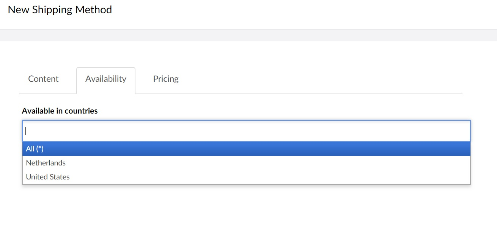

# Configuring Shipping Methods

In some cases a webshop has one or multiple shipping providers for package delivery to their customers. **Uvendia** provides you with the functionality to configure all your shipping methods. Go to _Uvendia > Settings > Order Settings > Shipping Method_ and add your payment services by hitting the button ```Create Shipping method```. 


## Tab: Content
On the create form first tab ```Content``` you can provide a name, disabled or enabled, description, shipping method logo and the estimate delivery time. 

## Tab: Availability
On the second tab ```Availability``` you can specify the countries in which the shipping method will be available. For instance if you have customers in a country where a specific shipping provider is not available, based on this given information you can disable it for those specific customers.
The countries displayed here are specified in the settings section [Available countries](/settings/availablecountries.md) on _Uvendia > Settings > Order Settings > Available Countries_. The asterisk (*) symbol means that it will be available in every country around the world - you can also leave it empty



## Tab: Pricing
On the third tab ```Pricing``` you can specify the extra fees that will be charged to the customers for using the shipping method. These are of course optional.


#### Cost per weight (in gram)
By filling in this field shipping fees will be charged based on the weight of the product(s) the customer ordered. The weight of each product is specified on the [Product](/assets/product.md) page. The **Uvendia** ```Order``` object calculates the shipping fees based on the amount of products and their weights in the basket.

#### Fixed fees
Use next table to specify fixed fees (prices) for each used [Price Definition](/settings/pricedefinition.md). For instance if you specify for the definition ```EUR``` 1 EUR, then for each order, 1 EUR will be charged for the delivery.

